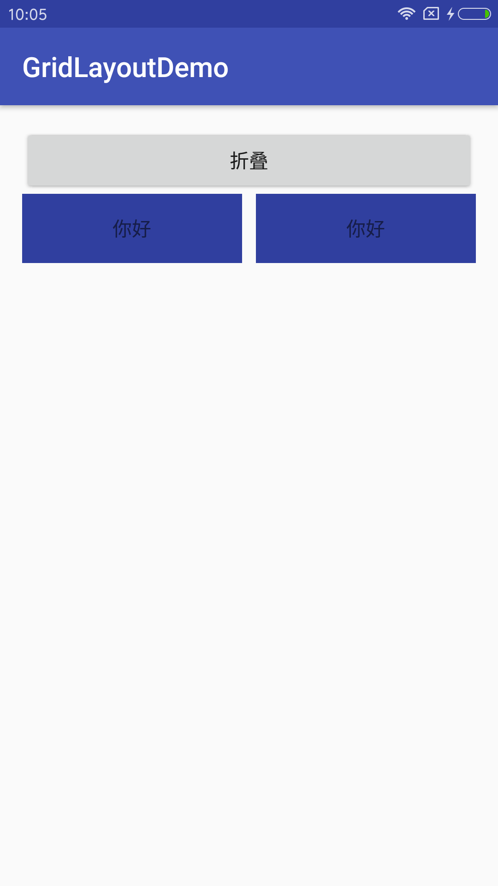
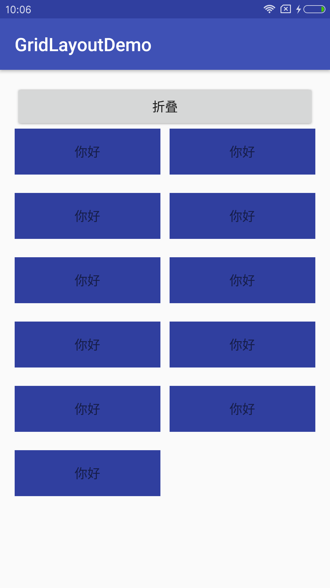
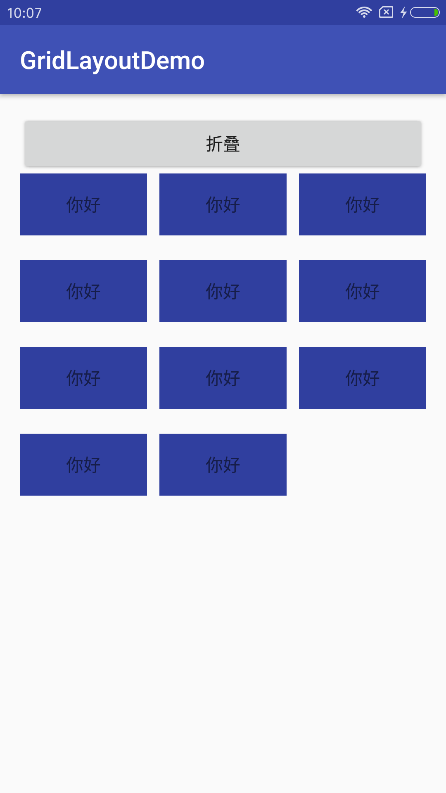
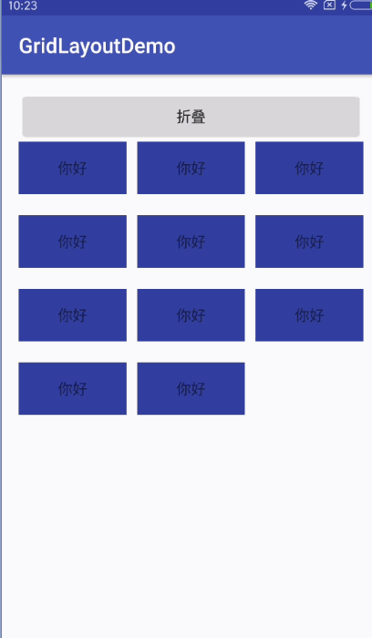

支持网格布局

    <com.hn.gridlayoutdemo.HnGridLayout
        android:id="@+id/hgl"
        app:horizontalSpacing="10dp"	//水平间距
        app:verticalSpacing="20dp"		//竖直间距
        app:collapseDuration="500"		//折叠动画间隔时间
        app:firstCollapse="true"		//第一次是否折叠
        app:columnsSize="2"				//列数
        android:layout_width="match_parent"
        android:layout_height="wrap_content"
	>

	</com.hn.gridlayoutdemo.HnGridLayout>

## 预览

